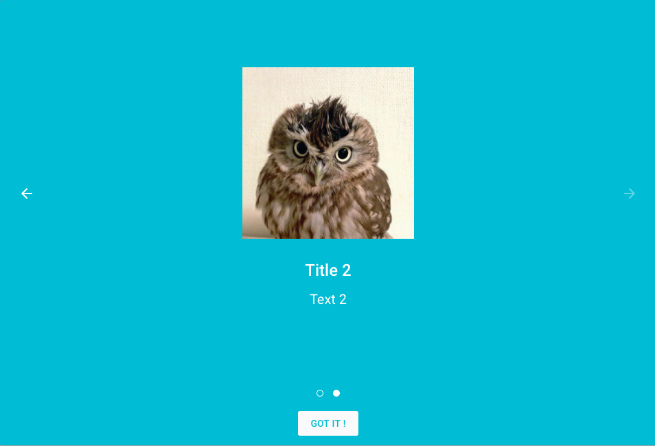
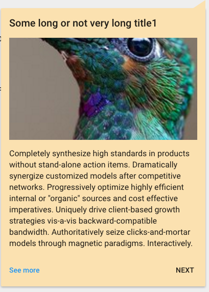

#    User guidance

Active guidance is becoming increasingly important to deliver delightful user experience in modern applications.
Pip.WebUI.Guidance module allows to make introductions to new users, notify about new releases or provide useful tips
and quotes with just few lines of code.

The module requires **guides**, **tips** and **quotes** standard REST API to be available on the server.

### Introductory and release guidance

Introductory guidance that tells to new user a story about the application. Release guidance that explain changes in the new product version.

Todo: Replace the guidance dialog with the real one

### Useful tips

Tips can provide useful advices for the current page or application context where user is working on.

Todo: Replace that with two images: one with real tip and another one with real quote on the **entire** application screen

### Inspirational quotes

Quotes visualize inspirational ideas to user, entertain them, give them food for thoughts.

Todo: Add screenshot with inspiration quote

### pipGuidance service

**pipGuidance** service provides a convenient method to open guidance dialogs or popups with tips and quotes, using data pulled from the server and filtered for specific page or context.

Todo: Add code snippet that shows how to open dialogs and popups

## Learn more about the module

- [User's guide](doc/UsersGuide.md)
- [Online samples](http://webui.pipdevs.com/pip-webui-guidance/index.html)
- [API reference](http://webui-api.pipdevs.com/pip-webui-guidance/index.html)
- [Developer's guide](doc/DevelopersGuide.md)
- [Changelog](CHANGELOG.md)
- [Pip.WebUI project website](http://www.pipwebui.org)
- [Pip.WebUI project wiki](https://github.com/pip-webui/pip-webui/wiki)
- [Pip.WebUI discussion forum](https://groups.google.com/forum/#!forum/pip-webui)
- [Pip.WebUI team blog](https://pip-webui.blogspot.com/)

## Module dependencies

* [pip-webui-lib](https://github.com/pip-webui/pip-webui-lib): angular, angular material and other 3rd party libraries
* [pip-webui-css](https://github.com/pip-webui/pip-webui-css): CSS styles and web components
* [pip-webui-core](https://github.com/pip-webui/pip-webui-core): localization and other core services
* [pip-webui-rest](https://github.com/pip-webui/pip-webui-rest): REST resources for guides, tips and quotes
* [pip-webui-layouts](https://github.com/pip-webui/pip-webui-layouts): dialog layout
* [pip-webui-pictures](https://github.com/pip-webui/pip-webui-pictures): picture control

## License

This module is released under [MIT license](License) and totally free for commercial and non-commercial use.
